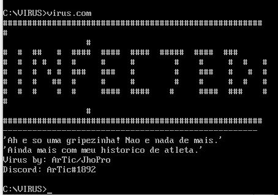
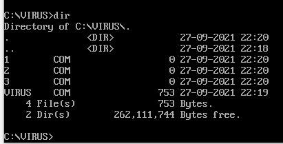
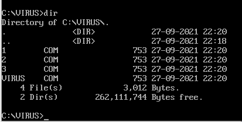

# Overwriting-DOS-Virus
A simple virus that overwrites COM files by itself. Made in x86 Assembly.
It only works in MS-DOS or DOS-Box. NOTE: IT ONLY OVERWRITE FILES AT THE
SAME FOLDER THAT YOU WILL RUN THE VIRUS!!!
# WARNING
Use tasm to compile this file.
THIS VIRUS IS JUST FOR EDUCATIONAL PURPOSES
NOTE: IT ONLY OVERWRITE FILES AT THE SAME FOLDER THAT YOU WILL RUN THE VIRUS!!!

